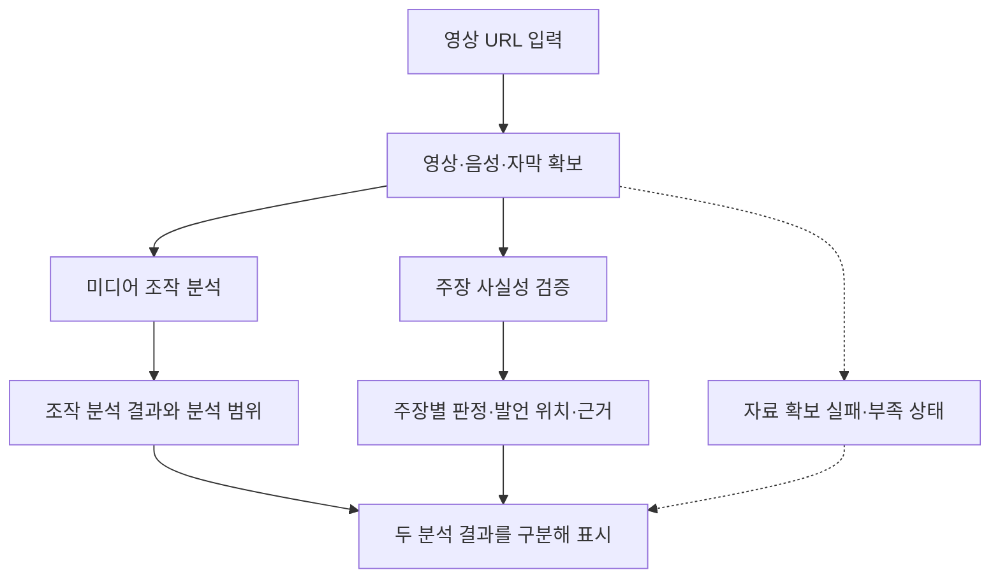
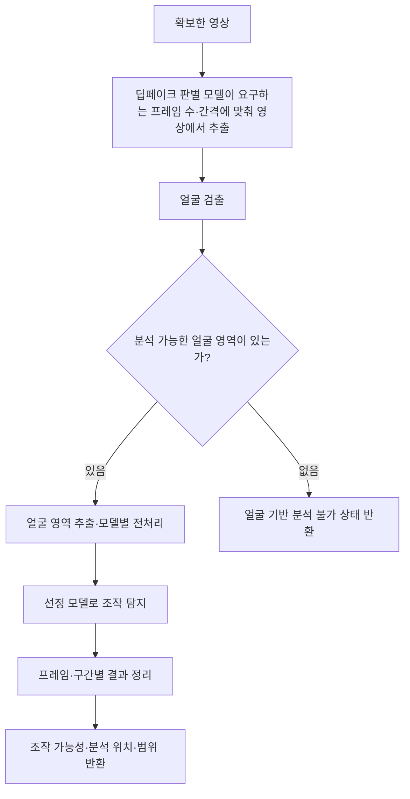
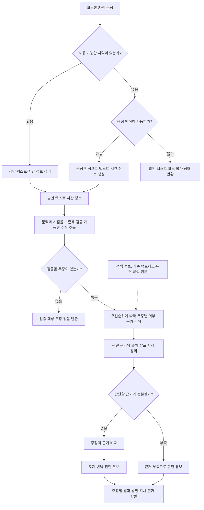

# Conan AI (가제) AI 파이프라인

- 상태: `Draft`
- 구조·파이프라인 설계 담당: 조정준 팀장
- AI 모델 선정·테스트 담당: 나정균 팀원
- 관련 문서: [제품 요구사항](../project/prd.md), [킥오프 회의록](../meetings/2026-09-03-kickoff.md)

## 문서의 기준

Conan AI (가제)의 초기 자료조사 및 기획 시안을 바탕으로 처리 흐름과 기술 후보를 구체화한 설계 초안이다. 제품의 목적과 범위는 제품 요구사항을 참조한다.

아래 구조와 기술은 검토 대상이며 채택된 기술 스택이 아니다. 기술 후보의 링크는 초기 조사 과정에서 수집했으며, 최신 기능·라이선스·성능을 원문과 대조하지 않았다. 별도 학습 없이 구현하고 공수를 줄일 수 있다는 예상도 검증 전 가설이다.

## 처리 흐름 제안

영상 URL에서 분석에 필요한 자료를 확보한 뒤 미디어 조작 분석과 주장 검증을 각각 수행한다. 아래는 검토용 흐름도이며, 특정 모델이나 API의 채택을 뜻하지 않는다. 검색 수단의 실행 순서와 병렬 처리 여부는 미정이다.

### 전체 흐름

두 경로는 서로의 판정을 전제로 하지 않는다. 결과를 한 화면에 모으더라도 하나의 진위 점수로 합치지 않는다. 한쪽만 분석 가능한 경우의 부분 결과와 실패 안내는 추가 설계 제안이며, 구체적인 표시 방식은 미정이다.

### 미디어 조작 분석

아래는 얼굴 기반 모델을 사용하는 경우의 흐름이다. 모델 선정 결과에 따라 프레임 대신 연속된 영상 구간 등 다른 입력 구성이 필요할 수 있다.

얼굴을 찾지 못한 것을 정상 영상 판정으로 처리하지 않는 방안을 제안한다. 얼굴이 여러 명일 때의 처리, 결과 집계와 표시 기준은 미정이다.

MVP는 얼굴 합성·변형과 영상 전체 AI 생성을 탐지 범위에 포함하며 음성 합성은 제외한다. 위 얼굴 기반 흐름과 별도로, 얼굴이 없거나 영상 전체가 AI로 생성된 경우에 필요한 입력 데이터, 탐지 기술 후보와 기존 파이프라인 연결 방식을 설계한다.

### 주장 사실성 검증

자막 경로는 검토 중인 초안이다. [9월 5일 회의](../meetings/2026-09-05-progress.md)에서는 자막이 없거나 전체 발언을 담지 못하는 경우를 고려해 활용 방식 또는 제외 여부를 추가 기획에서 검토하기로 했다. 자막의 채택 여부와 사용 가능 기준, 음성 인식 실패 처리, 검증할 주장 선정과 근거 충분성 기준은 미정이다. 근거가 확보되어도 서로 충돌하거나 결론을 내리기 어려우면 판단을 유보하는 방안을 제안한다. 검색 결과가 없다는 이유만으로 주장을 거짓으로 판정하지 않는다.

#### 주장 선정과 처리 순서

지원 주제는 제한하지 않는다. 영상에서 외부 근거와 사실 여부를 비교할 수 있는 주장을 모두 추출한다. 의견, 감상, 질문처럼 사실 판정이 불가능한 문장은 제외한다. 같은 의미를 다른 표현으로 반복한 주장은 하나로 합치고, 발언 위치 목록과 반복 횟수를 보관한다.

처리 우선순위는 다음 기준을 순서대로 적용한다.

1. 영상 제목과 전체 내용에서 핵심 주제로 판단되는지 확인한다.
2. 같은 주장이 영상에서 반복해서 언급되었는지 확인한다.
3. 인물, 기관, 날짜, 수치와 사건처럼 외부 근거와 대조할 구체적인 정보가 포함되었는지 확인한다.
4. 앞의 조건이 같으면 영상에서 먼저 등장한 주장을 우선한다.

우선순위는 처리 순서만 결정한다. 낮은 순위의 주장도 모두 검증하며, 검색 결과가 없거나 근거가 부족하면 해당 주장을 누락하지 않고 `근거 부족` 상태로 반환한다.

#### 진행 상태와 결과 전달

MVP는 Firestore 실시간 구독, WebSocket과 SSE를 사용하지 않고 `jobId` 기반 폴링으로 진행 상태와 결과를 전달한다. 분석 요청을 받으면 서버는 `jobId`를 반환하고, 클라이언트는 1~2초 간격으로 해당 작업의 상태를 조회한다. 서버는 주장별로 대기·처리 중·완료·실패 상태와 완료된 결과를 누적해 반환한다. 클라이언트는 새로 완료된 주장 결과를 화면에 추가한다.

서버는 우선순위가 높은 주장부터 검증을 시작한다. 병렬 처리 여부와 관계없이 모든 주장의 상태와 우선순위를 유지하며, 완료된 결과를 폴링 응답에 포함한다. 폴링 간격 조정, 작업 만료, 재시도와 중단 조건은 구현 단계에서 정한다.

점선은 보조 정보 또는 예외 경로를 나타낸다. 도식은 주요 분기를 설명하며 재시도·시간 초과·모델 실행 오류 등 모든 예외를 정의한 구현 명세는 아니다.

## 단계별 설계 초안

| 단계 | 입력 → 출력 구상 | 확인할 사항 |
| --- | --- | --- |
| 데이터 확보 | URL → 영상·음성·자막 | 지원 URL, 실제 수집 가능 여부, 이용 조건, 실패 처리 |
| 발언 텍스트 생성 | 자막 또는 음성 → 텍스트·시간 정보 | 자막 품질, 한국어 인식 품질, 자막이 부정확할 때의 처리 |
| 영상 전처리 | 영상 → 샘플 프레임·얼굴 영역 | 샘플링 간격, 모델별 전처리 조건, 얼굴이 없거나 여러 명인 경우 |
| 딥페이크 조작 탐지 | 전처리한 얼굴 이미지 또는 연속된 영상 프레임을 딥페이크 판별 AI 모델에 전달 → 이미지·영상 구간별 조작 가능성 분석 결과 | 판별 모델 선정, 필요한 이미지 크기·프레임 수 등 입력 형식, 탐지 범위, 개별 결과를 영상 단위로 정리하는 방식과 판정 기준 |
| 주장 추출 | 텍스트·시간 정보 → 중복을 합친 검증 대상 주장·발언 위치·반복 횟수·우선순위 | 사용할 모델과 구조화된 출력 형식, 문맥·시점 보존 방식 |
| 근거 검색 | 주장 → 관련 근거 문서 | 한국어 검색 수단, 원문 확보, 검색 범위와 날짜 조건 |
| 근거 비교 | 주장·근거 → 지지·반박·근거 부족 결과 | 판단 기준, 서로 충돌하는 근거, 인용과 원문의 일치 여부 |
| 결과 전달 | `jobId`와 주장별 상태·완료 결과 → 폴링 응답 | 폴링 간격 조정, 작업 만료, 재시도·중단 조건, 부분 성공·실패 표시 문구와 결과 데이터 형식 |

분석 작업 대기열, Worker, 상태 모델, 동시 처리와 결과 캐시는 [분석 실행 구조와 확장 기준](analysis-runtime.md)에서 정의한다.

여기서 딥페이크 판별 AI 모델은 이미지나 영상의 시각적 특징을 분석해 조작 가능성을 판단하는 모델을 뜻한다. 구체적인 모델은 나정균 팀원이 선정·테스트 중이다. 모델에 따라 얼굴 이미지 한 장을 분석하거나 연속된 여러 프레임을 함께 분석할 수 있으므로, 전달할 데이터의 형식과 전처리 방법은 선정 결과에 맞춰 정한다.

영상에서 프레임을 추출하는 간격과 개수는 딥페이크 판별 모델의 입력 조건과 테스트 결과에 따라 정한다.

## 기술 후보

모든 후보의 라이선스와 사용 조건은 미확인이다. 코드뿐 아니라 사용하려는 모델 가중치와 데이터의 조건도 별도로 확인해야 한다. 외부 API와 서비스는 오픈소스와 구분해 검토한다.

| 영역 | 기술 후보·출처 | 선정 전 확인할 내용 |
| --- | --- | --- |
| 영상 확보 | [yt-dlp](https://github.com/yt-dlp/yt-dlp) | 실제 입력에서 수집 가능 여부, 자막 확보, 서비스 이용 조건 |
| 영상·이미지 처리 | FFmpeg, OpenCV | 공식 출처 링크 확인 필요. 공식 출처·라이선스와 필요한 처리 범위 확인 |
| 얼굴 검출 | [MediaPipe](https://github.com/google-ai-edge/mediapipe) | 선정 모델에 필요한 얼굴 검출·전처리와 호환되는지 확인 |
| 음성 인식 | [Whisper](https://github.com/openai/whisper), [faster-whisper](https://github.com/SYSTRAN/faster-whisper) | 한국어 입력 품질, 실행 환경, 처리 시간·메모리 비교 |
| 시간 정보 정렬 | [WhisperX](https://github.com/m-bain/whisperX) | 기본 시간 정보로 충분한지, 추가 정렬의 필요성과 비용 확인 |
| 조작 탐지 모델 비교 | [DeepfakeBench](https://github.com/SCLBD/DeepfakeBench) | 실제 사용할 개별 모델, 가중치, 탐지 범위와 실행 조건 확인 |
| 주장 추출 | 일반 LLM과 구조화된 출력 | 구체적인 모델·제공 방식·비용은 미정 |
| 기존 팩트체크 검색 | [Google Fact Check Tools API](https://developers.google.com/fact-check/tools/api) | 한국어 주장 검색 결과, 접근 조건과 제한 확인 |
| 뉴스 검색 | [GDELT](https://www.gdeltproject.org/) | 한국어 검색 품질, API 사용 조건과 원문 확보 방식 확인 |
| 국내 근거 검색 | 네이버 뉴스, Google News, 국내 언론사·정부·공공기관 자료 | 검색·접근 수단과 공식 출처·사용 조건은 미정 |
| 주장과 근거 비교 | LLM, NLI 또는 조합 | 구체적인 모델과 한국어 판정 품질은 미정 |

초기 조사에서 수집한 조작 탐지 후보는 Xception, MesoNet, EfficientNet, Face X-Ray, F3Net, SBI, LSDA, Effort, TALL, I3D, STIL, FTCN, X-CLIP, TimeTransformer, VideoMAE다. 각 후보의 지원 여부와 적합성은 확인 전이며, 이 목록을 테스트 대상이나 우선순위로 확정하지 않는다.

faster-whisper의 우선 도입 여부는 비교 결과를 확인한 뒤 결정한다. WhisperX의 추가 도입, DeepfakeBench 활용과 검색 서비스 선택도 모델 테스트 및 설계 검토 후 결정한다.

## 주장 검색과 근거 비교의 쟁점

현재 설계안은 언론사·팩트체크 기관이 이미 공개한 주장 검증 결과와 관련 뉴스·공식 자료를 검색하고, 확보한 근거를 영상 속 주장과 비교하는 방식이다. 두 종류의 자료를 동시에 검색할지, 이미 공개된 검증 결과를 먼저 찾고 해당 결과가 없을 때 뉴스·공식 자료를 검색할지는 미정이다.

검색한 자료 중 정부·공공기관의 발표 등 해당 주장을 직접 확인할 수 있는 원문을 우선 검토하는 방향을 고려한다. 다만 발행 기관만으로 자료를 근거로 사용할지 결정하지 않고, 영상 속 주장과 실제로 관련이 있는지, 발표 시점이 주장에서 다루는 시점과 맞는지도 확인해야 한다. 자료를 선택하는 구체적인 기준과 자료마다 내용이 다를 때의 판단 방식은 TODO다. 관련 자료를 찾지 못한 경우에는 주장을 거짓으로 판정하지 않고 근거 부족으로 판단을 유보하는 처리 기준을 구체화한다.

NLI, Cross Encoder, Reranker는 추가 조사 후보로 남긴다. 검색 결과 순위 조정과 최종 주장 판정 중 어느 단계에 필요한지는 아직 결정하지 않았다.

## 모델 테스트와 평가 결과 연계

나정균 팀원이 비공개 Playground 저장소에서 모델 테스트를 진행 중이며, 결과는 별도로 남겨 전달하기로 했다. 킥오프에서 정한 9월 5일 준비 항목은 딥페이크 판별 모델의 성능·신뢰도 비교다. 이 문서에는 전달받지 않은 실험 결과를 작성하지 않는다.

실험 코드·샘플·실행 스크립트는 Playground에서 관리한다. 결과를 받으면 저장소 기준에 따라 `evaluations/` 기록과 연결하고, 이 문서에는 채택한 모델과 설계에 미친 영향만 반영한다. 평가 기록의 실제 위치와 링크는 결과 공유 시 확인한다.

모델 비교 시 검토할 항목은 탐지 방식, 데이터셋 간 성능, 대상 조작 유형, 사전 학습 가중치, GPU·메모리 요구량, 처리 시간, 모델 크기, 라이선스와 유지보수 상태다. 이는 나정균 팀원이 실제 수행한 테스트 항목을 뜻하지 않는다. FaceForensics++, Celeb-DF, DFDC 역시 초기 조사에서 수집한 데이터셋 예시이며 사용 여부는 확인되지 않았다.

## 성능 측정

단계별 처리 시간과 자원 사용량, 복수 요청과 폴링 부하의 측정 항목은 [분석 실행 구조와 확장 기준](analysis-runtime.md#성능-측정)에서 관리한다. 이 문서에서는 선정 모델의 입력 조건과 단계별 분석 방법에 영향을 주는 평가 결과만 반영한다.

## 함께 검토할 사항

1. 제품에서 약속할 조작 탐지 범위와 테스트 중인 모델의 탐지 범위가 일치하는지 확인한다.
2. 지원할 영상 조건과 실행 환경을 정한 뒤 수집부터 결과까지 연결 가능한지 확인한다.
3. 한국어 주장에 필요한 근거를 어떤 검색 수단으로 확보할지 정한다.
4. 단계별 입출력 형식, 처리 시간·비용 한도와 실패 처리 방식을 정한다.
5. 모델 평가 결과를 바탕으로 기술 후보를 줄이고 구현 가설을 갱신한다.
