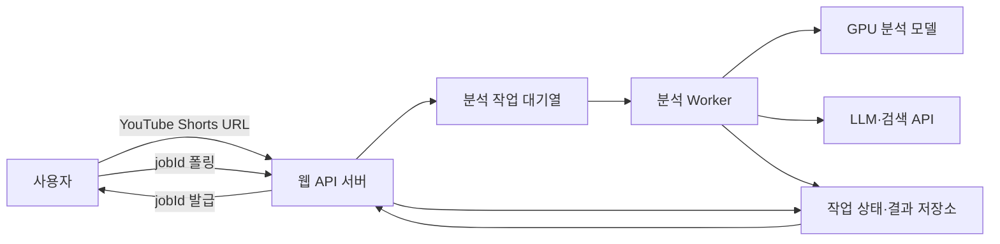

# Conan AI (가제) 분석 실행 구조와 확장 기준

- 상태: `Draft`
- 관련 문서: [제품 요구사항](../project/prd.md), [MVP 검토 목록](../project/mvp-review.md), [AI 파이프라인](ai-pipeline.md), [프로젝트 계획](../project/project-plan.md)

## 문서의 기준

분석 요청을 접수한 뒤 작업을 실행하고 상태와 결과를 전달하는 구조를 정의한다. AI 파이프라인의 단계별 분석 방법과 입출력은 [AI 파이프라인](ai-pipeline.md)에서 관리한다. 사용자가 보게 되는 기능과 처리 시간은 [제품 요구사항](../project/prd.md)에서 관리한다.

1차 MVP의 동시 처리 기준을 현재 실행 기준으로 사용한다. 성능 측정 결과에 따라 처리량을 늘릴 때는 이 문서의 측정 항목과 확장 조건을 사용한다. 구체적인 배포 장비, 요청당 비용과 캐시 기간은 미정이다.

## 작업 특성과 실행 환경

아래 표는 확정된 배포 구성이 아니다. 현재 검토 중인 처리 방식에서 사용할 가능성이 있는 자원과 측정 대상을 정리한 설계 가설이다. 선정 모델, 외부 API와 구현 방식에 따라 실제 실행 위치와 자원 구성이 달라질 수 있다.

| 단계 | 예상 자원·실행 후보 | 현재 상태 | 확인할 내용 |
| --- | --- | --- | --- |
| URL 확인·영상 다운로드 | 네트워크, 메모리 또는 임시 디스크 | 네트워크 접근 필요. 저장 방식 미정 | YouTube 응답 시간, 동시 다운로드 제한, 저장 방식, 다운로드 실패와 임시 용량 |
| 프레임·음성 추출 | CPU·메모리, 임시 디스크 후보 | FFmpeg 사용 후보. 실행 구성 미정 | 작업 수에 따른 CPU·메모리 사용량과 임시 파일 정리 |
| 음성 인식 | CPU 또는 GPU | 모델과 실행 장치 미정 | 한국어 인식 품질, 처리 시간과 메모리 사용량 |
| 얼굴 합성·변형 탐지 | GPU 우선 검토, CPU 실행 가능 여부 확인 | 모델 선정·테스트 중 | 모델별 실행 장치, GPU 메모리, 입력 프레임 수와 처리 시간 |
| 영상 전체 AI 생성 탐지 | CPU 또는 GPU | 탐지 경로와 모델 미정 | 얼굴 기반 모델과의 자원 공유 여부와 별도 실행 경로 |
| 주장 추출·근거 판정 | 외부 LLM API 또는 자체 모델 | 모델과 제공 방식 미정 | 토큰 사용량, 호출 제한, 응답 시간, 비용과 실패 처리 |
| 근거 검색 | 외부 검색 API 또는 직접 검색 | 검색 수단 미정 | 주장 수에 따른 호출량, 호출 제한, 응답 시간과 비용 |
| 작업 상태·결과 저장과 폴링 | API 서버와 데이터 저장소 | 폴링 구조 결정. 구체적인 저장 기술 미정 | 폴링 주기, 동시 조회 수와 작업 데이터 만료 |

> TODO: 나정균 팀원이 선정한 모델과 API 연동 환경에서 단계별 실행 장치, 자원 사용량과 처리 시간을 검증한 뒤 이 표의 현재 상태와 확인 결과를 기록한다.

각 단계가 요구하는 자원이 다르므로 웹 요청 처리와 장시간 분석 작업을 분리한다. GPU가 사용 중이어도 API 서버는 새 요청을 접수하고 대기 상태를 반환할 수 있어야 한다.

## 분석 실행 구조

웹 API 서버는 입력 조건을 확인하고 `jobId`를 발급한 뒤 작업을 대기열에 넣는다. 분석 Worker는 대기열에서 작업을 가져와 [AI 파이프라인](ai-pipeline.md)의 단계를 실행한다. 처리 중인 상태와 완료된 주장 결과는 저장소에 누적한다. API 서버는 폴링 요청을 받으면 현재 상태와 새로 완료된 결과를 반환한다.

## 1차 MVP 동시 처리 기준

| 대상 | 기준 | 초과 시 처리 |
| --- | --- | --- |
| 전체 영상 분석 | 분석 Worker 1개로 동시에 1건 실행 | 대기열에 넣어 순차 처리 |
| GPU 모델 | 동시에 1건 실행 | 현재 GPU 작업이 끝날 때까지 대기 |
| 주장별 근거 검색·판정 | 한 영상 안에서 최대 3건 병렬 실행 | 우선순위가 높은 주장부터 다음 묶음으로 처리 |
| 브라우저 세션별 활성 분석 | 동시에 1건 | 진행 중인 작업을 안내하고 새 분석 시작을 제한 |

전체 영상 분석을 한 건씩 실행해 초기 GPU 메모리 부족과 자원 경합을 줄인다. 주장별 검증은 최대 3건을 병렬로 실행해 첫 결과와 전체 결과의 대기 시간을 줄인다. 병렬 처리 수와 관계없이 [주장 우선순위](ai-pipeline.md#주장-선정과-처리-순서)를 유지하며 모든 검증 대상의 상태를 저장한다. 로그인·회원가입을 사용하지 않으므로 활성 분석 제한은 계정이 아닌 브라우저 세션을 기준으로 적용한다.

## 작업 상태

| 상태 | 의미 | 전환 조건 |
| --- | --- | --- |
| `queued` | 요청을 접수했으며 Worker 할당을 기다린다. | Worker가 작업을 가져가면 `processing`으로 전환 |
| `processing` | 영상 확보 또는 분석을 진행한다. | 첫 결과가 준비되면 `partially_completed`, 모든 처리가 끝나면 `completed`로 전환 |
| `partially_completed` | 일부 주장 또는 분석 결과를 제공했으며 나머지를 처리 중이다. | 모든 처리가 끝나면 `completed`, 복구할 수 없는 오류가 발생하면 `failed`, 분석 시간 상한을 넘으면 `timed_out`으로 전환 |
| `completed` | 지원 범위의 모든 분석이 끝났다. | 최종 상태 |
| `failed` | 자료 확보 실패나 실행 오류로 더 진행할 수 없다. | 재시도 정책에 따라 새 작업을 생성할 수 있으며 세부 기준은 미정 |
| `timed_out` | 분석 시작 후 최대 처리 시간을 초과했다. | 완료된 결과를 보존하고 끝나지 않은 항목을 시간 초과로 표시 |

대기열에서 기다린 시간과 Worker가 작업을 시작한 뒤의 분석 시간을 구분한다. 최대 10분의 처리 제한은 `processing`으로 전환한 시점부터 계산한다. 화면에는 대기 상태와 분석 진행 상태를 구분해 표시한다.

## 처리 시간 기준

처리 시간은 성능 측정 전의 잠정 목표다.

| 구간 | 잠정 기준 |
| --- | --- |
| 요청 접수와 진행 화면 표시 | 요청 후 2초 이내 |
| 첫 주장 검증 결과 | 분석 시작 후 1분 이내 |
| 전체 분석 결과 | 분석 시작 후 5분 이내 목표 |
| 최대 처리 시간 | 분석 시작 후 10분 |

전체 분석이 5분을 넘겨도 최대 10분까지 계속한다. 10분을 초과하면 작업을 `timed_out`으로 전환하고 완료된 결과를 제공하며, 끝나지 않은 주장은 `시간 초과`로 표시한다. 2026년 9월 8일 공유할 `evaluations`와 API 연동 후의 전체 파이프라인 측정 결과를 바탕으로 이 기준을 조정한다.

## 분석 결과 캐시

동일 영상의 반복 요청에는 YouTube 영상 ID와 분석 파이프라인 버전을 캐시 키로 사용한다. 유효한 결과가 있으면 분석 ID와 분석 시각을 포함해 반환한다. 사용자가 `다시 분석`을 요청하면 캐시를 건너뛴다. 캐시 결과를 반환하기 전에는 영상의 공개·삭제 상태를 다시 확인한다.

YouTube 영상은 새 영상으로 교체하면 URL이 바뀌지만 기존 URL을 유지한 채 구간 자르기·흐리기·오디오 변경이 가능하다. 영상 ID만으로 분석 결과를 무기한 재사용하지 않는다. 콘텐츠 해시를 확인하려면 영상을 다시 내려받아야 하므로 캐시 응답의 속도 이점이 줄어든다. MVP에서는 유효기간을 둔 캐시와 강제 재분석 수단을 사용한다. 정확한 유효기간과 저장 기간은 요청당 비용과 저장 비용을 측정한 뒤 결정한다.

## 성능 측정

2026년 9월 8일 공유할 `evaluations`의 미디어 조작 모델 실행 시간과 API 연동 후 측정할 전체 파이프라인 시간을 구분한다.

| 측정 대상 | 기록할 지표 |
| --- | --- |
| 영상 다운로드 | 소요 시간, 영상 길이, 파일 크기와 실패 여부 |
| 프레임·음성 전처리 | 소요 시간, CPU·메모리 최대 사용량, 프레임 수와 임시 파일 용량 |
| 음성 인식 | 소요 시간, 실행 장치, 모델과 메모리 사용량 |
| 미디어 조작 탐지 | 모델별 소요 시간, GPU 메모리 최대 사용량, 입력 프레임 수 |
| 주장 추출 | 소요 시간, 모델·API, 입력·출력 토큰과 주장 수 |
| 주장별 근거 검색·판정 | 첫 결과 시간, 전체 완료 시간, 병렬 처리 수, API 호출 수·실패율과 토큰 사용량 |
| 결과 반환 | 첫 결과와 전체 결과의 저장·응답 시간, 응답 크기 |
| 복수 요청 | 대기 시간, 전체 처리 시간, 자원 최대 사용량과 오류율 |
| 폴링 | 폴링 주기별 API·데이터 저장소 요청 수, 응답 시간과 오류율 |
| 작업 종료 | 실패·시간 초과 후 GPU 메모리와 임시 파일 해제 여부 |

측정할 때는 같은 입력 영상과 실행 환경을 사용하고 영상 길이, 캐시 사용 여부, 분석 파이프라인 버전을 함께 기록한다. 한 영상 실행 결과와 두 요청을 연속·동시에 실행한 결과를 비교한다. 주장 검증은 병렬 처리 수를 1건과 3건으로 나눠 첫 결과 시간, 전체 완료 시간, 호출 오류와 비용 변화를 확인한다.

## 처리량 확장 기준

다음 조건을 측정한 뒤 분석 Worker 수, GPU 동시 실행 수 또는 주장 검증 병렬 처리 수를 조정한다.

1. 대기 시간이 정한 목표를 반복해서 초과하는지 확인한다.
2. GPU 메모리와 CPU·메모리에 동시 실행 여유가 있는지 확인한다.
3. 두 영상의 동시 실행이 단일 실행보다 오류율과 처리 시간을 허용할 수 있는 범위로 유지하는지 확인한다.
4. LLM·검색 API의 호출 제한과 요청당 비용 한도 안에서 병렬 요청을 늘릴 수 있는지 확인한다.
5. 폴링 요청 증가가 API 서버와 데이터 저장소의 응답 시간을 허용 범위 이상으로 늦추지 않는지 확인한다.
6. 작업 실패 후 자원이 정상적으로 해제되어 다음 작업에 영향을 주지 않는지 확인한다.

Worker 수나 병렬 처리 수를 늘릴 때는 변경 전후의 입력 조건과 지표를 같은 방식으로 기록한다. 장비 사양이나 모델 변경으로 얻은 개선과 동시 처리 수 변경의 효과를 구분한다.

## 미결 사항

| 항목 | 확인할 내용 | 결정 조건 |
| --- | --- | --- |
| 실행 장비 | API 서버와 분석 Worker의 배포 위치, CPU·메모리·GPU 사양 | 선정 모델과 API 연동 환경 확인 후 |
| 요청당 비용 | GPU 실행, LLM·검색 API, 데이터 저장 비용의 평균·최대값 | 단계별 비용 측정 후 |
| 캐시 기간 | 분석 결과 유효기간, 저장 기간과 만료 데이터 삭제 방식 | 캐시 적중 효과와 저장 비용 측정 후 |
| 대기열 한도 | 최대 대기 작업 수와 장시간 대기 시 안내·거절 기준 | 동시 요청 시험 후 |
| 재시도 | 단계별 자동 재시도 횟수와 중복 비용 방지 방식 | 실패 유형과 빈도 측정 후 |
