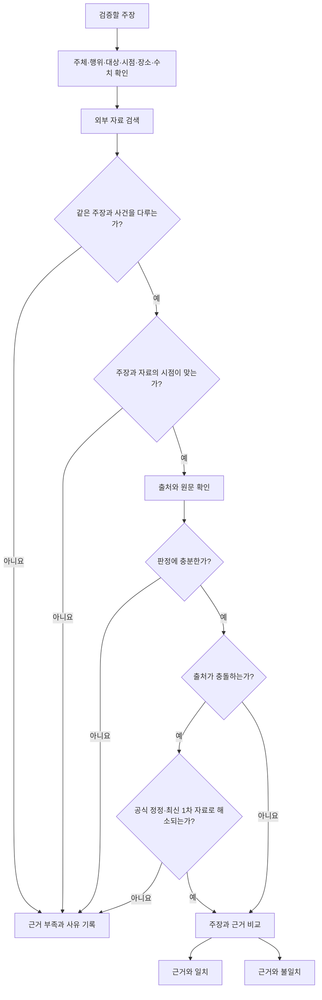

# 주장 근거 선택과 판정 정책

- 상태: `Accepted`
- 결정 담당: 조정준 팀장
- 구현·검증 담당: 나정균 팀원
- 관련 문서: [AI 파이프라인](ai-pipeline.md), [분석 결과 UI](result-ui.md), [제품 요구사항](../project/prd.md)

## 목적과 적용 범위

영상에서 추출한 주장과 외부 자료를 연결하고 `근거와 일치`, `근거와 불일치`, `근거 부족`으로 판정할 때 적용할 기준을 정의한다. 검색 기술과 판정 모델이 달라져도 같은 기준으로 결과를 만들고 검수하기 위한 제품 정책이다.

이 문서는 검색 API, LLM과 NLI 모델의 구체적인 선정이나 점수 임계값을 정하지 않는다. 사용할 기술과 품질 평가는 [MVP 검토 목록의 T-08·T-11](../project/mvp-review.md#3-구현-방식과-기술-검증)에서 다룬다.

## 판정 절차

판정은 다음 순서로 진행한다.

1. 주장에 포함된 주체, 행위, 대상, 시점, 장소와 수치를 확인한다. 해당 요소가 다르면 같은 키워드가 등장해도 같은 주장에 대한 근거로 연결하지 않는다.
2. 자료가 주장의 핵심 내용을 직접 다루는지 확인한다. 주변 주제나 일부 표현만 같은 자료는 판정 근거에서 제외한다.
3. 주장과 자료의 기준 시점이 맞는지 확인한다. 이후 공식 정정이 확인되면 정정 전 자료보다 최신 정정 자료를 우선한다.
4. 자료의 출처, 발행일과 원문을 확인한다. 검색 결과의 제목이나 요약문만으로 판정하지 않는다.
5. 확보한 자료가 주장의 핵심 내용을 판정하기에 충분한지 확인한다.
6. 출처가 충돌하면 공식 정정이나 최신 1차 자료로 충돌이 해소되는지 확인한다. 해소되지 않으면 어느 한쪽을 임의로 선택하지 않는다.
7. 근거가 주장의 핵심 내용을 직접 뒷받침하면 `근거와 일치`, 직접 반박하면 `근거와 불일치`로 판정한다. 어느 쪽도 충족하지 못하면 `근거 부족`으로 판정한다.

## 출처 선택 기준

정부·공공기관 자료, 법령·통계 원문, 연구 원문, 당사자의 공식 발표처럼 주장과 직접 관련된 1차 출처를 우선한다. 1차 출처가 없으면 서로 독립적인 신뢰 가능한 자료 두 개 이상을 확인한다. 같은 보도자료나 기사를 재전송한 자료는 독립된 출처로 세지 않는다.

출처의 이름이나 유형만으로 신뢰성을 확정하지 않는다. 원문이 실제로 주장과 같은 사건·대상·시점을 다루는지 확인하고, 인용한 설명이 원문의 내용과 일치해야 한다.

## 판정별 기준

| 판정 | 적용 조건 | 결과에 포함할 내용 |
| --- | --- | --- |
| `근거와 일치` | 적합한 근거가 주장의 핵심 내용을 직접 뒷받침한다. | 확인된 내용, 판정 이유, 출처 정보와 원문 링크 |
| `근거와 불일치` | 적합한 근거가 주장의 핵심 내용을 직접 반박하거나 다른 사실을 명확히 제시한다. | 불일치한 내용, 판정 이유, 출처 정보와 원문 링크 |
| `근거 부족` | 자료가 없거나 관련성·시점·신뢰성·내용이 부족하다. 출처가 충돌하거나 주장의 일부만 확인된 경우도 포함한다. | 판정하지 못한 구체적인 사유와 확보한 참고 자료가 있으면 해당 자료 |

주장의 일부만 확인된 경우에는 전체 주장이 확인된 것처럼 판정하지 않는다. 사용자가 한계를 알 수 있도록 확인된 부분과 확인되지 않은 부분을 구분하고 `근거 부족`으로 처리한다.

## 근거 부족 사유

`근거 부족`은 다음 사유 중 하나 이상을 함께 기록한다.

- 검색했지만 관련 자료를 찾지 못함
- 자료가 같은 주제만 다루고 해당 주장을 직접 확인하지 못함
- 주장과 자료의 기준 시점이 다름
- 출처의 원문, 신뢰성 또는 내용이 판정에 충분하지 않음
- 신뢰할 수 있는 출처들이 서로 충돌하며 공식 정정이나 최신 1차 자료로 해소되지 않음
- 복합 주장의 일부만 확인됨

검색 결과가 없다는 사실은 `근거와 불일치`의 근거로 사용하지 않는다.

## 출처 충돌과 정정

출처가 충돌하면 양쪽 자료와 충돌 지점을 함께 보관한다. 공식 정정이나 같은 사건을 다루는 최신 1차 자료가 기존 내용을 명확히 대체할 때만 이를 우선해 판정한다. 어느 자료가 우선하는지 확인할 수 없으면 `근거 부족`으로 처리하고 사용자 결과에도 충돌 사실을 표시한다.

## 구현과 검수 기준

나정균 팀원은 주장별로 비교한 핵심 요소, 채택·제외한 출처, 출처 발행일, 판정 사유와 근거 부족 사유를 추적할 수 있도록 결과 데이터를 구성한다. 조정준 팀장은 [분석 결과 UI](result-ui.md)의 주장 카드에서 사용자에게 필요한 판정 이유와 출처가 표시되는지 확인한다.

데모 검수에서는 사전에 고정한 기대 주장·판정·근거와 결과를 비교한다. 다른 주장이나 다른 시점의 자료를 연결하거나 원문과 다른 내용을 근거로 제시하면 해당 데모 영상은 정확성 기준을 통과하지 못한다.
