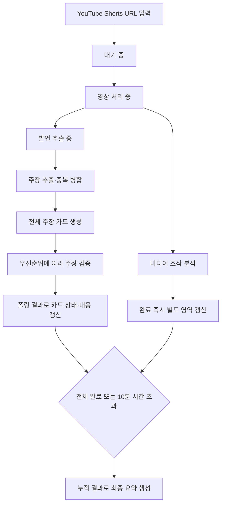

# Conan AI (가제) 분석 진행과 결과 UI 흐름

- 상태: `Draft`
- 관련 문서: [제품 요구사항](../project/prd.md), [MVP 검토 목록](../project/mvp-review.md), [AI 파이프라인](ai-pipeline.md), [분석 실행 구조](analysis-runtime.md), [프로젝트 계획](../project/project-plan.md)

## 문서의 기준

분석 요청 이후 진행 상태, 순차 도착하는 결과와 최종 요약을 화면에 표시하는 흐름을 정의한다. 제품에서 제공할 결과 범위는 [제품 요구사항](../project/prd.md), 서버의 작업 상태와 전환 조건은 [분석 실행 구조](analysis-runtime.md), 분석 단계는 [AI 파이프라인](ai-pipeline.md)에서 관리한다.

분석 중에는 완료된 주장별 전체 분석 결과와 미디어 조작 결과를 순차 제공한다. 전체 작업이 완료되거나 시간 초과로 종료되면 누적된 결과를 바탕으로 최종 요약을 제공한다. 여기서 주장별 전체 분석 결과는 사용자에게 제공하기로 한 주장, 판정, 발언 위치, 근거와 출처를 뜻하며 모델의 원시 응답을 뜻하지 않는다.

## 전체 흐름

미디어 조작 분석과 주장 사실성 검증은 독립적으로 진행한다. 어느 결과가 먼저 도착할지는 보장하지 않으며, 각 영역은 해당 결과가 준비되는 즉시 갱신한다.

## 단계별 화면 흐름

1. 사용자가 YouTube Shorts URL을 입력한다.
2. 요청 직후에는 현재 진행 상태만 표시한다.
   - 대기 중
   - 영상 처리 중
   - 발언 추출 중
   - 주장 검증 준비 중
3. 주장 추출이 끝나기 전에는 완료 개수와 전체 주장 수를 표시하지 않는다.
   - 안내 문구 예시: `검증 결과를 준비하고 있습니다.`
4. 주장 추출과 중복 병합이 끝나면 전체 주장 수를 확정하고 모든 주장 카드를 생성한다.
   - 안내 문구 예시: `검증할 주장 8개를 찾았습니다.`
   - 진행 표시 예시: `3/8개 완료`
5. 각 주장 카드는 우선순위에 따른 처리 상태를 표시한다.
   - 대기 중
   - 검증 중
   - 완료
   - 근거 부족
   - 실패
   - 시간 초과
6. 폴링으로 결과가 도착하면 해당 주장 카드를 즉시 갱신한다.
7. 미디어 조작 결과는 별도 영역에서 완료되는 즉시 표시한다.
8. 분석 시작 후 5분을 넘으면 장시간 처리 안내를 표시하고 처리를 계속한다.
9. 모든 작업이 끝나거나 분석 시작 후 10분을 넘으면 누적된 결과로 최종 요약을 만든다.
10. 10분 시간 초과 시 완료된 결과는 유지하고 끝나지 않은 카드에 시간 초과 상태를 표시한다.

## 서버 상태와 UI 표시

| 서버 상태 | 화면 표시 | 결과 처리 |
| --- | --- | --- |
| `queued` | 대기 중 | 분석 결과를 표시하지 않는다. |
| `processing:collecting` | 영상 처리 중 | 영상과 분석 자료를 확보한다. |
| `processing:transcribing` | 발언 추출 중 | 전체 주장 수를 표시하지 않는다. |
| `processing:extracting_claims` | 검증 결과 준비 중 | 주장 추출과 중복 병합이 끝날 때까지 기다린다. |
| `processing:verifying` | 주장 검증 중 | 모든 주장 카드를 만들고 카드별 상태를 표시한다. |
| `partially_completed` | 일부 결과 확인 가능 | 완료된 카드와 미디어 조작 결과를 도착하는 순서대로 갱신한다. |
| `completed` | 분석 완료 | 누적 결과로 최종 요약을 표시한다. |
| `completed_with_limitations` | 일부 분석 완료 | 완료 결과를 유지하고 분석하지 못한 영역과 이유를 표시한다. |
| `timed_out` | 분석 시간 초과 | 완료 결과를 유지하고 미완료 카드의 시간 초과를 안내한다. |
| `failed` | 분석 실패 | 실패 단계와 다시 시도 가능 여부를 안내한다. |

API의 세부 상태값은 연동 과정에서 조정할 수 있다. 상태 이름이 달라져도 위 화면 단계와 전환 의미는 유지한다.

## 주장 카드

주장 추출과 중복 병합이 끝나면 검증할 모든 주장 카드를 먼저 생성한다. 사용자는 전체 처리 대상을 확인할 수 있으며, 서버는 우선순위가 높은 주장부터 처리한다.

각 카드에는 다음 정보를 필수로 표시한다.

- 주장 내용
- 처리 상태
- 판정
- 발언 위치
- 핵심 근거
- 근거 출처

처리 상태와 검증 판정을 분리한다. 처리 상태는 대기 중·검증 중·완료·실패·시간 초과를 사용한다. 검증 판정은 다음 세 가지를 사용하며 확률이나 숫자 점수는 표시하지 않는다.

| 검증 판정 | 의미 |
| --- | --- |
| `근거와 일치` | 확보한 신뢰 가능한 근거가 주장을 뒷받침한다. |
| `근거와 불일치` | 확보한 신뢰 가능한 근거가 주장을 반박한다. |
| `근거 부족` | 사실 여부를 판단하기에 충분한 근거를 확보하지 못했다. |

`근거와 일치`·`근거와 불일치` 판정에는 판정 근거와 원문 출처를 최소 1개 제공한다. 출처에는 자료 제목, 발행 기관·언론사, 발행일, 원문 링크와 해당 자료가 주장을 지지하거나 반박하는 이유를 포함한다. 출처 유형도 함께 표시한다.

`근거 부족`에는 출처를 필수로 요구하지 않는다. 자료 없음, 주장과의 관련성 부족, 시점 불일치, 출처 간 결론 충돌 또는 출처의 신뢰성·내용 부족 중 판정하지 못한 이유를 표시한다. 확보했지만 판정에 충분하지 않은 자료가 있으면 참고 자료로 제공한다. 출처가 충돌하면 어느 한쪽을 선택하지 않고 서로 다른 자료와 내용을 함께 표시한다.

검증 가능한 주장을 찾지 못하면 빈 주장 카드를 만들지 않고 별도 상태를 표시한다.

> 영상에서 외부 근거로 확인할 수 있는 주장을 찾지 못했습니다.

발언이 일정 구간에 걸치면 시작·종료 시점을 표시하고 해당 위치로 이동할 수 있게 한다. 음성 인식으로 추출한 발언인지 구분한다. 정확한 위치를 확보하지 못하면 `약 00:18` 또는 `발언 위치 확인 불가`처럼 한계를 표시한다.

처리 우선순위나 처리 순서를 카드에 직접 표시할지는 별도로 정한다. 완료되지 않은 카드에는 판정이나 근거가 준비된 것처럼 표시하지 않는다. 폴링 응답이 도착하면 카드 상태를 먼저 갱신하고, 제공 가능한 판정·발언 위치·근거·출처를 추가한다.

## 미디어 조작 결과

미디어 조작 결과는 주장 카드와 분리된 영역에 표시한다. 분석 중에는 현재 상태를 표시하고 결과가 준비되면 즉시 갱신한다. 주장 검증이 끝날 때까지 미디어 조작 결과 표시를 미루지 않는다.

얼굴 합성·변형 탐지와 영상 전체 AI 생성 탐지 결과를 구분한다. 각 결과는 다음 네 단계로 표시한다.

| 단계 | 의미 |
| --- | --- |
| `조작 의심` | 정한 판정 기준을 넘어서는 조작 징후가 확인됐다. |
| `뚜렷한 조작 징후 없음` | 분석 범위에서 판정 기준을 넘는 징후가 확인되지 않았다. |
| `판단 보류` | 결과가 기준 부근이거나 입력 품질이 낮아 한쪽으로 판단하기 어렵다. |
| `분석 불가` | 얼굴 없음, 프레임 부족 또는 모델 오류 등으로 해당 분석을 수행하지 못했다. |

`조작되지 않음`이나 `실제 영상`처럼 조작이 없다고 단정하는 표현은 사용하지 않는다. 색상은 문구를 대신하지 않는 보조 수단으로 사용하며 구체적인 색상과 아이콘은 UI 시안에서 정한다.

## 장시간 처리와 시간 초과

분석 시작 후 5분을 넘으면 결과 영역을 유지하면서 장시간 처리 안내를 추가한다.

> 분석이 예상보다 오래 걸리고 있습니다. 완료된 결과부터 확인할 수 있습니다.

분석 시작 후 10분을 넘으면 완료된 주장과 미디어 조작 결과를 유지한다. 끝나지 않은 주장 카드는 `시간 초과`로 전환하고, 최종 요약에 완료·미완료·시간 초과 수를 구분한다. 구체적인 실패·부분 결과 문구와 다시 시도 방식은 U-05에서 결정한다.

## 실패와 부분 결과

일부 분석만 끝난 경우에도 성공한 결과를 유지한다. 화면 상단에는 `일부 분석만 완료되었습니다.`라고 표시하고, 분석하지 못한 영역과 이유를 해당 결과 영역에 함께 표시한다. `partially_completed`는 분석이 계속되는 상태, `completed_with_limitations`는 일부 결과만 남기고 종료된 상태로 구분한다.

| 상황 | 전체 처리 | 사용자 표시 |
| --- | --- | --- |
| 지원하지 않는 URL·Shorts가 아님 | 분석 시작 안 함 | 지원 조건 안내 |
| 일부 공개·비공개·연령 제한 영상 | 분석 시작 안 함 | 접근할 수 없는 영상임을 안내 |
| 영상 다운로드 실패 | 분석 중단 | 영상 확보 실패와 다시 시도 안내 |
| 얼굴을 찾지 못함 | 주장 검증과 영상 전체 AI 생성 탐지 계속 | 얼굴 합성·변형 `분석 불가` |
| 얼굴 탐지 모델 오류 | 가능한 다른 분석 계속 | 해당 탐지만 `분석 불가` |
| 영상 전체 AI 생성 탐지 오류 | 얼굴 합성·변형과 주장 검증 계속 | 해당 탐지만 `분석 불가` |
| 음성 인식을 사용할 수 없음 | 미디어 분석 계속 | 주장 사실성 검증 `분석 불가` |
| 검증 가능한 주장이 없음 | 정상 종료 | 검증할 주장을 찾지 못했다는 안내 |
| 주장 하나의 검증 실패 | 나머지 주장 계속 | 해당 카드 `실패` |
| 주장 근거가 부족함 | 정상 결과로 처리 | 해당 카드 `근거 부족`과 이유 |
| 10분 시간 초과 | 완료된 결과 유지 | 나머지 카드 `시간 초과` |
| 모든 분석이 실패함 | 전체 실패 | 결과 없음과 다시 시도 안내 |

영상 다운로드 실패, 외부 API 응답 실패, 모델 실행 오류와 시간 초과에는 `다시 분석` 기능을 제공한다. 지원하지 않는 입력이나 검증할 주장 없음에는 다시 분석을 강조하지 않는다. 기술 오류 코드 대신 사용자가 이해할 수 있는 설명을 제공하고 분석 ID로 내부 오류를 추적한다.

## 최종 요약

최종 요약은 모든 작업이 완료되거나 10분 시간 초과로 종료된 뒤 생성한다. 분석 중 화면 상단에는 최종 요약 대신 진행 현황을 표시한다.

최종 요약에는 다음 정보를 포함한다.

- 미디어 조작 결과
- 사실·거짓·근거 부족 주장 수
- 완료·미완료·시간 초과 주장 수
- 전체 분석 상태
- 분석 ID
- 분석 시각

내부 MVP 검수에서 사용하는 A ~ F 처리 완성도 등급은 사용자 화면에 표시하지 않는다. 사용자에게는 완료한 항목 수와 전체 항목 수를 표시한다.

## 미결 사항

| 항목 | 확인할 내용 | 검토 ID |
| --- | --- | --- |
| 발언 위치·근거 | 필수 포함으로 결정. 구체적인 컴포넌트 배치와 이동 방식은 UI 시안에서 확인 | U-02 |
| 주장 판정 | `근거와 일치`·`근거와 불일치`·`근거 부족`으로 결정. 판정별 색상과 세부 문구는 UI 시안에서 확인 | U-03 |
| 미디어 조작 표시 | 네 단계 표현 결정. 구체적인 색상과 아이콘은 UI 시안에서 확인 | U-04 |
| 실패·부분 결과 | 상태·단계별 계속 처리와 다시 분석 기준 결정. 구체적인 안내 문구는 UI 시안에서 확인 | U-05 |
| 전체 발언문 | 영상 전체 발언문 제공 여부와 펼침·이동 방식 | 별도 결정 필요 |
