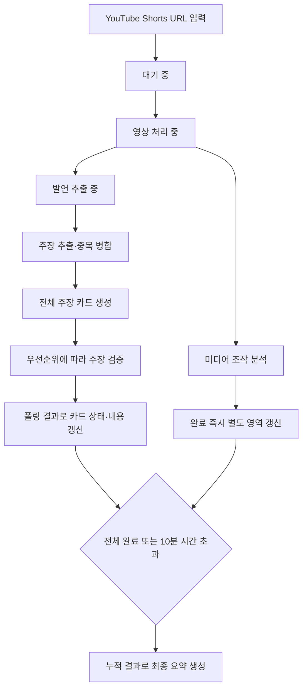

# Conan AI (가제) 분석 진행과 결과 UI 흐름

- 상태: `Draft`
- 관련 문서: [제품 요구사항](../project/prd.md), [MVP 검토 목록](../project/mvp-review.md), [AI 파이프라인](ai-pipeline.md), [분석 실행 구조](analysis-runtime.md), [프로젝트 계획](../project/project-plan.md)

## 문서의 기준

분석 요청 이후 진행 상태, 순차 도착하는 결과와 최종 요약을 화면에 표시하는 흐름을 정의한다. 제품에서 제공할 결과 범위는 [제품 요구사항](../project/prd.md), 서버의 작업 상태와 전환 조건은 [분석 실행 구조](analysis-runtime.md), 분석 단계는 [AI 파이프라인](ai-pipeline.md)에서 관리한다.

분석 중에는 완료된 주장별 전체 분석 결과와 미디어 조작 결과를 순차 제공한다. 전체 작업이 완료되거나 시간 초과로 종료되면 누적된 결과를 바탕으로 최종 요약을 제공한다. 여기서 주장별 전체 분석 결과는 사용자에게 제공하기로 한 주장, 판정, 발언 위치, 근거와 출처를 뜻하며 모델의 원시 응답을 뜻하지 않는다.

## 전체 흐름

미디어 조작 분석과 주장 사실성 검증은 독립적으로 진행한다. 어느 결과가 먼저 도착할지는 보장하지 않으며, 각 영역은 해당 결과가 준비되는 즉시 갱신한다.

## 단계별 화면 흐름

1. 사용자가 YouTube Shorts URL을 입력한다.
2. 요청 직후에는 현재 진행 상태만 표시한다.
   - 대기 중
   - 영상 처리 중
   - 발언 추출 중
   - 주장 검증 준비 중
3. 주장 추출이 끝나기 전에는 완료 개수와 전체 주장 수를 표시하지 않는다.
   - 안내 문구 예시: `검증 결과를 준비하고 있습니다.`
4. 주장 추출과 중복 병합이 끝나면 전체 주장 수를 확정하고 모든 주장 카드를 생성한다.
   - 안내 문구 예시: `검증할 주장 8개를 찾았습니다.`
   - 진행 표시 예시: `3/8개 완료`
5. 각 주장 카드는 우선순위에 따른 처리 상태를 표시한다.
   - 대기 중
   - 검증 중
   - 완료
   - 근거 부족
   - 실패
   - 시간 초과
6. 폴링으로 결과가 도착하면 해당 주장 카드를 즉시 갱신한다.
7. 미디어 조작 결과는 별도 영역에서 완료되는 즉시 표시한다.
8. 분석 시작 후 5분을 넘으면 장시간 처리 안내를 표시하고 처리를 계속한다.
9. 모든 작업이 끝나거나 분석 시작 후 10분을 넘으면 누적된 결과로 최종 요약을 만든다.
10. 10분 시간 초과 시 완료된 결과는 유지하고 끝나지 않은 카드에 시간 초과 상태를 표시한다.

## 서버 상태와 UI 표시

| 서버 상태 | 화면 표시 | 결과 처리 |
| --- | --- | --- |
| `queued` | 대기 중 | 분석 결과를 표시하지 않는다. |
| `processing:collecting` | 영상 처리 중 | 영상과 분석 자료를 확보한다. |
| `processing:transcribing` | 발언 추출 중 | 전체 주장 수를 표시하지 않는다. |
| `processing:extracting_claims` | 검증 결과 준비 중 | 주장 추출과 중복 병합이 끝날 때까지 기다린다. |
| `processing:verifying` | 주장 검증 중 | 모든 주장 카드를 만들고 카드별 상태를 표시한다. |
| `partially_completed` | 일부 결과 확인 가능 | 완료된 카드와 미디어 조작 결과를 도착하는 순서대로 갱신한다. |
| `completed` | 분석 완료 | 누적 결과로 최종 요약을 표시한다. |
| `timed_out` | 분석 시간 초과 | 완료 결과를 유지하고 미완료 카드의 시간 초과를 안내한다. |
| `failed` | 분석 실패 | 실패 단계와 다시 시도 가능 여부를 안내한다. |

API의 세부 상태값은 연동 과정에서 조정할 수 있다. 상태 이름이 달라져도 위 화면 단계와 전환 의미는 유지한다.

## 주장 카드

주장 추출과 중복 병합이 끝나면 검증할 모든 주장 카드를 먼저 생성한다. 사용자는 전체 처리 대상을 확인할 수 있으며, 서버는 우선순위가 높은 주장부터 처리한다.

각 카드에는 다음 영역을 둔다. 필수 포함 여부와 구체적인 표현은 U-02와 U-03에서 확정한다.

- 주장 내용
- 처리 우선순위 또는 처리 순서
- 처리 상태
- 판정
- 발언 위치
- 핵심 근거
- 근거 출처

완료되지 않은 카드에는 판정이나 근거가 준비된 것처럼 표시하지 않는다. 폴링 응답이 도착하면 카드 상태를 먼저 갱신하고, 제공 가능한 판정·발언 위치·근거·출처를 추가한다.

## 미디어 조작 결과

미디어 조작 결과는 주장 카드와 분리된 영역에 표시한다. 분석 중에는 현재 상태를 표시하고 결과가 준비되면 즉시 갱신한다. 주장 검증이 끝날 때까지 미디어 조작 결과 표시를 미루지 않는다.

조작 가능성의 단계, 점수, 색상, 문구와 분석 불가 표시는 U-04에서 결정한다.

## 장시간 처리와 시간 초과

분석 시작 후 5분을 넘으면 결과 영역을 유지하면서 장시간 처리 안내를 추가한다.

> 분석이 예상보다 오래 걸리고 있습니다. 완료된 결과부터 확인할 수 있습니다.

분석 시작 후 10분을 넘으면 완료된 주장과 미디어 조작 결과를 유지한다. 끝나지 않은 주장 카드는 `시간 초과`로 전환하고, 최종 요약에 완료·미완료·시간 초과 수를 구분한다. 구체적인 실패·부분 결과 문구와 다시 시도 방식은 U-05에서 결정한다.

## 최종 요약

최종 요약은 모든 작업이 완료되거나 10분 시간 초과로 종료된 뒤 생성한다. 분석 중 화면 상단에는 최종 요약 대신 진행 현황을 표시한다.

최종 요약에는 다음 정보를 포함한다.

- 미디어 조작 결과
- 사실·거짓·근거 부족 주장 수
- 완료·미완료·시간 초과 주장 수
- 전체 분석 상태
- 분석 ID
- 분석 시각

내부 MVP 검수에서 사용하는 A~F 처리 완성도 등급은 사용자 화면에 표시하지 않는다. 사용자에게는 완료한 항목 수와 전체 항목 수를 표시한다.

## 미결 사항

| 항목 | 확인할 내용 | 검토 ID |
| --- | --- | --- |
| 발언 위치·근거 | 주장 카드에 반드시 포함할 정보와 출처 연결 방식 | U-02 |
| 주장 판정 | 사실·거짓·근거 부족의 명칭, 문구와 근거 충돌 표시 | U-03 |
| 미디어 조작 표시 | 가능성 단계, 점수, 색상, 문구와 분석 불가 표시 | U-04 |
| 실패·부분 결과 | 수집·음성 인식 실패, 일부 성공, 다시 시도와 시간 초과 안내 | U-05 |
| 전체 발언문 | 영상 전체 발언문 제공 여부와 펼침·이동 방식 | 별도 결정 필요 |
